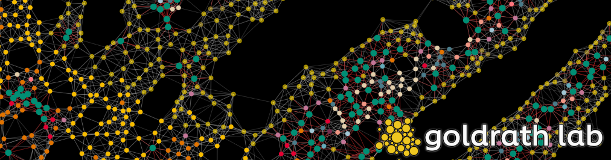

# Functional Diversity of Memory CD8 T Cells is Spatiotemporally Imprinted


> [!NOTE]
> In this repository, we show how to reproduce the figures from our 2024 manuscript[^1]. Additionally, we provide our data processing pipelines to create fully-processed Anndata objects containing all of the spatial data used to construct figures.

## Table of Contents

- [Abstract](#abstract)
- [Setup](#setup)
- [Download](#download)
- [Preprocessing](#preprocessing)
- [Figures](#figures)
- [Submitting changes](#submittingchanges)

## Abstract

## Setup

This repository contains a `devcontainer` to allow to run the scripts in a reproducible manner. Please see the [documentation](https://code.visualstudio.com/docs/devcontainers/containers) for further information on how to use devcontainers.

## Download

TODO: Add Script to download the data.
Including villus_segmentation_mask.npy from xenium mouse 1 processing

## Preprocessing

Data from 10x Xenium and Vizgen MERSCOPE were preprocessed using a custom segmentation and annotation pipeline. These pipelines can be found on seperate GitHub repositories

- [Xenium nextflow segmentation pipeline](https://github.com/maximilian-heeg/xenium-segmentation) v0.1.2.
  The following parameters were set:

  ```text
  tile.minimal_transcripts = 300000
  baysor.prior_segmentation_confidence = 0.95
  ```

- [Merscope nextflow segmentation pipeline](https://github.com/maximilian-heeg/vizgen-segmentation/) v0.1.0

  ```text
  tile.minimal_transcripts = 5000000
  baysor.prior_segmentation_confidence = 0.9
  ```

In this project, we had four similar but separate processing pipelines for processing data from different settings.

1. Processing of Xenium mouse small intestine timecourse first replicates.
   [Xenium mouse rep 1 processing](/processing_pipelines/Xenium_mouse_replicate_1_processing)
2. Processing of Xenium mouse small intestine timecourse second replicates.
   [Xenium mouse rep 2 processing](/processing_pipelines/Xenium_mouse_replicate_2_processing)
3. Processing of MERSCOPE mouse small intestine WT vs TGFBR2 KO conditions.
   [MERSCOPE mouse processing](/processing_pipelines/MERSCOPE_mouse_processing)
4. Processing of Xenium human terminal ileum both replicates.
   [Xenium human processing](/processing_pipelines/Xenium_human_processing)

> [!NOTE]
> Part of our workflow included cell type annotation. This made use of manual exploration and is not well reflected in the code. We have provided excel sheets and csvs used to assign cell type annotations to cell clusters in each pipeline folder. Additionally, we labeled images manually in several parts of our pipelines. We have provided these labels in json format within each pipeline folder. Please [contact](#contact) us if you need us to give you intermediary objects at any point in the processing pipelines.

We also performed Immunofluorescence staining and H&E after our Xenium runs.
We show pipelines for aligning IF and H&E images with our Xenium data in:

1. Mouse data [Mouse histology alignment](/processing_pipelines/alignment/mouse_histology)
2. Human data [Human histology alignment](/processing_pipelines/alignment/human_histology)

## Figures

This section contains the scripts to reproduce the figures in the paper.

### Figure 1

| Figure | Link                                                  |
|--------|-------------------------------------------------------|
| 1b     | [Immunofluorescence IMAP](/Figure_1/1b.ipynb)         |
| 1c     | [Xenium, H&E, IF and transcripts](/Figure_1/1c.ipynb) |
| 1d     | [Overview plots](/Figure_1/1d.ipynb)                  |

### Figure 2

| Figure                 | Link                                                |
|------------------------|-----------------------------------------------------|
| 2a <br /> 2b <br /> 2c | [Axes in the small intestine](/Figure_2/2abc.ipynb) |
| 2d                     | [IMAP of P14](/Figure_2/2d.ipynb)                   |
| 2e <br /> 2f           | [Correlation along the axes](/Figure_2/2ef.ipynb)   |
| 2g                     | [Convolved expression heatmap](/Figure_2/2g.ipynb)  |
| 2h <br /> 2i           | [Expression IMAP of P14](/Figure_2/2hi.ipynb)       |
| 2j                     | [Signature IMAP of P14](/Figure_2/2j.ipynb)         |

### Figure 3

| Figure       | Link                                                                                                                                                                                  |
|--------------|---------------------------------------------------------------------------------------------------------------------------------------------------------------------------------------|
| 3a           | [Spatial graph of the small intestine](/Figure_3/3a.ipynb)                                                                                                                            |
| 3b <br /> 3c | [Co-localization of cells and P14 subsets](/Figure_3/3bc.ipynb)                                                                                                                       |
| 3d           | [Convolved expression heatmap of cytokines](/Figure_3/3d.ipynb)                                                                                                                       |
| 3e           | [TGFb isoforms in the small intestine](/Figure_3/3e.ipynb)                                                                                                                            |
| 3f           | [Timecourse of TGFb isoform expression](/Figure_3/3f.ipynb)                                                                                                                           |
| 3g           | Cellchat <br /> [Part 1: Preprocessing python](/Figure_3/3g_part1.ipynb) <br /> [Part 2: Run Cellchat](/Figure_3/3g_part2.ipynb) <br /> [Part 3: Make plot](/Figure_3/3g_part3.ipynb) |

### Figure 4

| Figure       | Link                                                          |
|--------------|---------------------------------------------------------------|
| 4a           | [Overview plots](/Figure_4/4a.ipynb)                          |
| 4b <br /> 4e | [IMAP and expression IMAP](/Figure_4/4be.ipynb)               |
| 4d           | [Differenitally expressed genes](/Figure_4/4d.ipynb)          |
| 4g <br /> 4h | [Correlation of expression to celltypes](/Figure_4/4gh.ipynb) |

### Figure 5

| Figure       | Link                                                                     |
|--------------|--------------------------------------------------------------------------|
| 5a <br /> 5b | [MDE plot and cell frequencies](/Figure_5/5ab.ipynb)                     |
| 5c           | TODO                                                                     |
| 5d           | [Mouse signature on human IMAP](/Figure_5/5d.ipynb)                      |
| 5e <br /> 5f | [Convolved expression heatmap](/Figure_5/5ef.ipynb)                      |
| 5g           | [Correlation between gene expression and cell types](/Figure_5/5g.ipynb) |
| 5h           | TODO                                                                     |

### Extended data figures

| Figure             | Link                                 |
|--------------------|--------------------------------------|
| ED 2b              | [Notebook](/Figure_2/2g.ipynb)       |
| ED 2d              | [Notebook](/Figure_2/2j.ipynb)       |
| ED 3d              | [Notebook](/Figure_3/3g_part3.ipynb) |
| ED 4a              | [Notebook](/Figure_3/3g_part3.ipynb) |
| ED 4f              | [Notebook](/Figure_4/4be.ipynb)      |
| ED 5b <br /> ED 5d | [Notebook](/Figure_5/5ab.ipynb)      |

## Submitting changes

> [!IMPORTANT]
> Make sure to run `pre-commit run --all-files` before commiting

## Contact

- Miguel Reina-Campos: :envelope: miguel@lji.org
- Alexander Monell: :envelope: amonell@ucsd.edu
- Maximilian Heeg: :envelope: mheeg@ucsd.edu
- Ananda Goldrath: :envelope: agoldrath@alleninstitute.org

[^1]: TODO add link to paper
